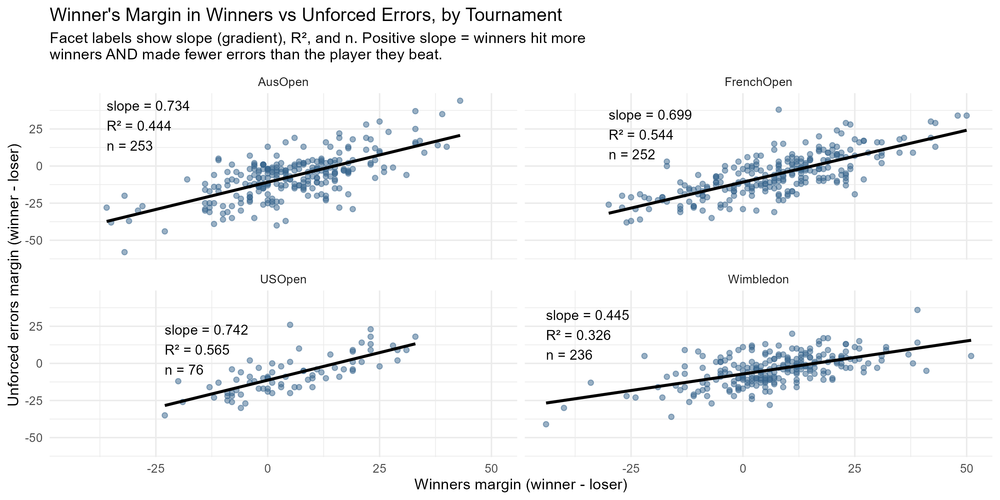
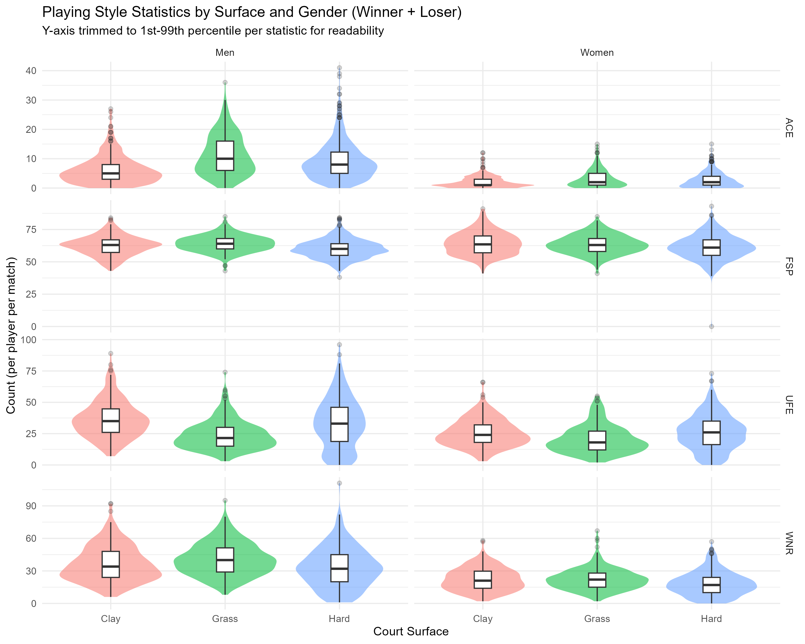

# Surface Effects on Playing Style in 2013 Grand Slam Tennis

An exploratory analysis of how court surface, gender, and tournament round shape
professional tennis playing style, using match-level statistics from all four 2013
Grand Slams (1,010 matches, UCI Machine Learning Repository).

📄 **[Full report (PDF)](Tennis_Report.pdf)** · 💻 **[R code](tennis_analysis.R)**

## Highlights

Winning margins in winners hit and unforced errors are positively related on every
surface, but the relationship is clearly weakest on grass, supporting the idea
that faster surfaces reward decisive, serve-driven points over sustained rally
control:

Court surface strongly shapes playing style, and the effect holds for both winners
and losers of each match:

All nine figures from the report are in [`figures/`](figures/), for anyone who
wants the images without opening the PDF.

## Method note

Player columns are recoded from the dataset's arbitrary "Player 1 / Player 2"
labels into winner/loser, based on match result. This makes every margin
statistic in the analysis mean the same thing throughout: how much better the
winner performed than the player they beat, rather than a P1-minus-P2 value that
could point in either direction from match to match depending on who was labelled
P1. See the full report for details, this recoding is what sharpens the
winners-vs-errors relationship above into something clearly interpretable.

## Data

[UCI Machine Learning Repository — Tennis Major Tournament Match Statistics](https://archive.ics.uci.edu/dataset/300/tennis+major+tournament+match+statistics)
(Australian Open, French Open, Wimbledon, US Open — men's and women's singles, 2013).

## Reproducing this analysis

1. Download the eight tournament CSVs from the UCI dataset page above into a
   single folder.
2. Update the `setwd()` path at the top of `tennis_analysis.R`.
3. Run the script, it prints a data dictionary and dataset size to the console,
   then builds each figure in sequence.

**Packages required:** `dplyr`, `tidyr`, `stringr`, `readr`, `ggplot2`.