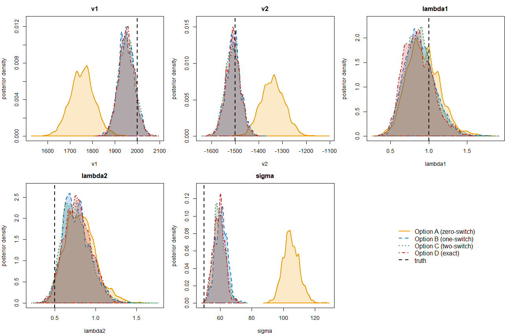
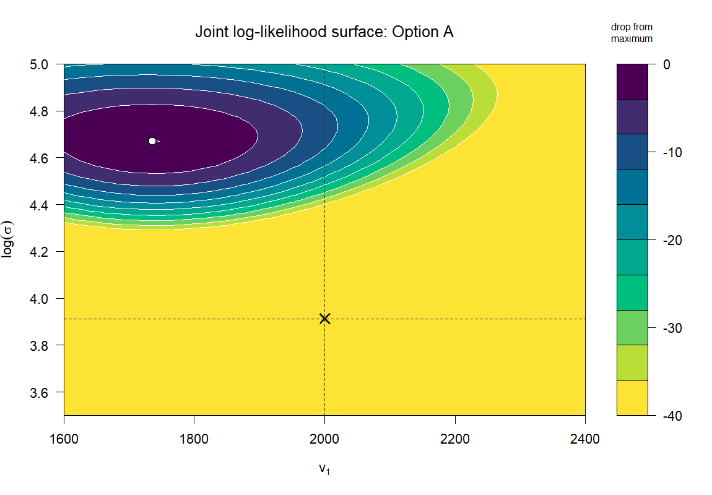
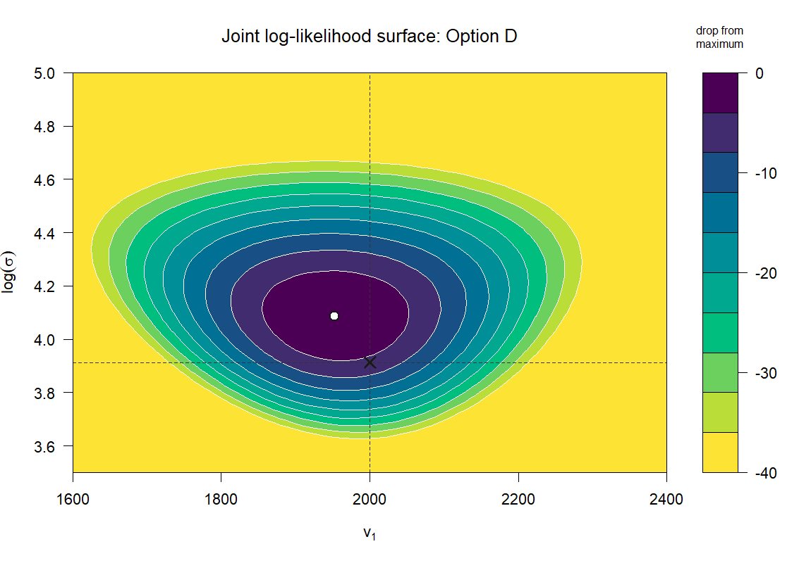

# Bayesian Inference for a Two-State Stochastic Velocity-Jump Model

MSc dissertation project (Liverpool John Moores University, supervised by Dr Ivo Siekmann).
A particle moves at one of two constant velocities, switching between them at random
times, and is observed only through noisy position measurements taken at a fixed frame
rate. The switching itself is never seen. This project derives an exact likelihood for
that model, implements it alongside three truncated approximations from the published
literature, and compares all four under a common Bayesian sampler.

**[Full report (PDF)](Dissertation_Report.pdf)** · **[R code](#code)**

Awarded 82%, the highest mark in the cohort. The results are currently being prepared for journal submission.

## Highlights

Four likelihood treatments were compared on identical data. The zero-switch
approximation (Option A) is confidently wrong: it recovers the velocities and the noise
scale well away from the values that generated the data, and its posterior is narrow
rather than uncertain. The one-switch, two-switch and exact treatments all sit on the
truth.

The reason is visible in the likelihood surface. Under Option A the maximum sits far
from the true parameters, which lie in the flat region beyond every contour band. Under
the exact likelihood the maximum sits beside them. Both plots share a colour scale, so
the contrast can be read directly.

The headline finding is that these two failures are different in kind. The residual
biases in the one-switch and two-switch approximations shrink and vanish as the number
of observations grows from 200 to 1600, so they are sample-size artefacts. Option A's
biases do not shrink, because the model it fits is not the model that generated the
data. More data cannot fix a misspecified likelihood.

## The derivation

The published framework this builds on approximates the likelihood by allowing at most
*m* velocity switches within each observation interval, giving a family of
approximations indexed by *m*. This project takes that family to its limit.

The key observation is that the displacement over an interval depends on the hidden
path only through the **occupation time**: how long the particle spent in state 1. The
distribution of that occupation time is a known result (Pedler, 1971), expressible via
modified Bessel functions. Splitting it by the parity of the switch count preserves the
start-to-end state routing that the forward recursion needs, which turns the infinite
sum over switch counts into a closed-form density.

That density is exact in the switch count, but its convolution with the normal
measurement noise has no closed form and is evaluated by composite Simpson quadrature,
with a grid-refinement study to justify the grid.

The derivation was checked three ways, each using quantities computed by routes that do
not rely on the derived formula, so an error could not propagate into its own check:

* against 400,000 directly simulated paths
* against exact normalisation of the resulting density
* against an independently implemented one-switch approximation, onto which the exact
  emission converges as the interval shortens

## What the exact likelihood does and does not buy you

At moderate switching rates it produces estimates no more accurate than the two-switch
truncation. At fast switching rates, where the truncations break down, it stays
correctly centred but the surface becomes nearly flat: the posterior widens because the
data no longer constrain the parameters, not because the method has failed. The
limiting resource is the number of observed switching events, not the number of frames.

At the fastest rates tested the posterior becomes multimodal, with a secondary mode in
which a large noise scale absorbs most of the variation in the data and the velocities
and rates are then only weakly constrained. This is treated as a feature of the model
class rather than a convergence failure, and the two modes are analysed separately.

## Code

Seven modules, base R only, no external packages.

| Module | Contents |
| --- | --- |
| `1_simulation.R` | Gillespie simulation of the velocity-jump process and noisy observation of it |
| `2a_likelihood_zero_switch.R` | Forward algorithm; zero-switch likelihood (Option A) |
| `2b_likelihood_one_switch.R` | Up-to-one-switch likelihood (Option B) |
| `2c_likelihood_two_switch.R` | Up-to-two-switch likelihood (Option C) |
| `2d_likelihood_exact.R` | Exact likelihood via the occupation-time density (Option D) |
| `3_mcmc_inference.R` | Adaptive Metropolis MCMC, convergence diagnostics, likelihood surfaces |
| `4_figures.R` | Posterior comparison figures, forest plots, summary tables |

Each module ends with a validation section that can be run on its own.

## Data

No external data. Every dataset in the report is simulated by `1_simulation.R` from
known parameters, which is what makes the comparison possible: the true values are
available to check recovery against, and the hidden switching path is stored so that
estimates can be compared against what the realised trajectory actually did rather than
only against the generating parameters.

## Reproducing this analysis

1. Clone or download this folder.
2. Create a `figures/` subfolder in the working directory.
3. Source the modules in order, `1_simulation.R` through `4_figures.R`. Each depends on
   the ones before it.

Random seeds are set throughout, so results reproduce exactly.

**Requirements:** R (base only). `besselI` and `expm`-equivalent matrix exponentiation
are implemented directly.

## A note on generative AI attribution

The code carries inline `[AI-GENERATED]` and `[AI-ASSISTED]` tags. These were required
by the assessment, which asked that examiners be able to distinguish code written by the
author from code produced with AI assistance. The derivation, the verification strategy,
and every interpretive claim in the report are the author's own.

## References

* Ceccarelli, A., Browning, A. P., and Baker, R. E. (2025). Approximate solutions of a
  general stochastic velocity-jump model subject to discrete-time noisy observations.
  *Bulletin of Mathematical Biology* 87, article 57.
  <https://doi.org/10.1007/s11538-025-01437-x> (open access)
* Pedler, P. J. (1971). Occupation times for two state Markov chains.
  *Journal of Applied Probability* 8(2), 381–390.
  <https://doi.org/10.2307/3211908>

The code accompanying Ceccarelli et al. is at
<https://github.com/a-ceccarelli/distributions_n-state_VJ_model>.
